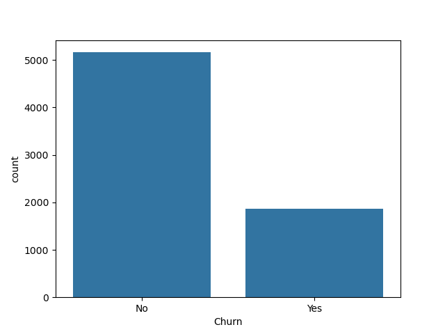
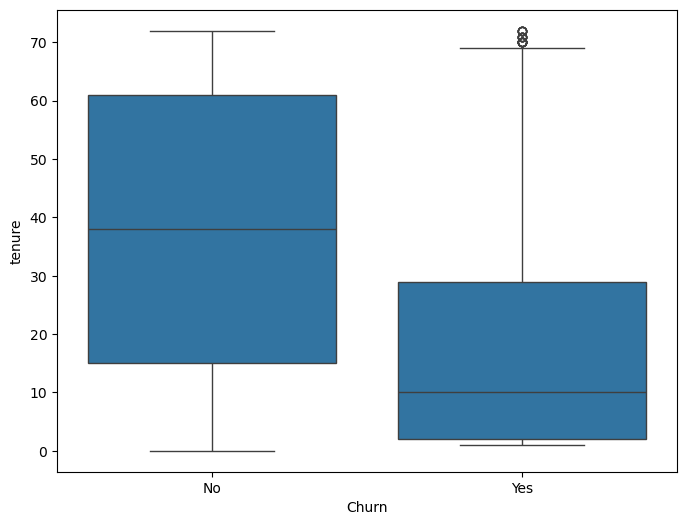
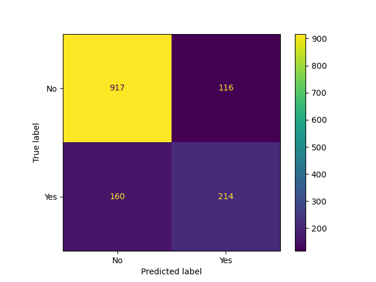
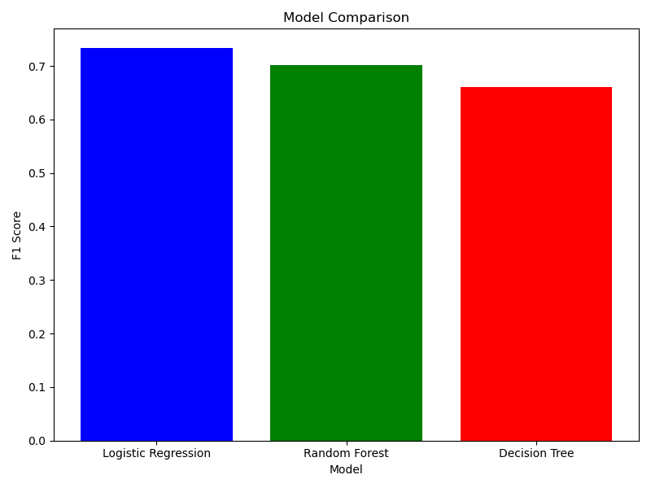

# Customer Churn Prediction

## Overview

This project builds an end-to-end Machine Learning pipeline to predict whether a telecom customer is likely to churn (leave the service) or stay.

The project demonstrates the complete machine learning workflow including data cleaning, exploratory data analysis (EDA), preprocessing pipelines, classification model comparison, cross-validation, model persistence, and inference using Scikit-Learn.

---

## Problem Statement

Customer churn is a major challenge for subscription-based businesses. Losing existing customers can significantly impact revenue and growth.

This project aims to predict whether a customer is likely to churn based on their demographics, account information, subscribed services, and billing details.

By identifying customers at risk of leaving, businesses can take proactive measures to improve customer retention.

---

## Dataset

Dataset Used: IBM Telco Customer Churn Dataset

### Features

| Feature          | Description                          |
| ---------------- | ------------------------------------ |
| gender           | Customer gender                      |
| SeniorCitizen    | Whether customer is a senior citizen |
| Partner          | Whether customer has a partner       |
| Dependents       | Whether customer has dependents      |
| tenure           | Number of months with the company    |
| PhoneService     | Phone service subscription           |
| MultipleLines    | Multiple phone lines subscription    |
| InternetService  | Internet service type                |
| OnlineSecurity   | Online security service              |
| OnlineBackup     | Online backup service                |
| DeviceProtection | Device protection service            |
| TechSupport      | Technical support subscription       |
| StreamingTV      | TV streaming subscription            |
| StreamingMovies  | Movie streaming subscription         |
| Contract         | Contract type                        |
| PaperlessBilling | Paperless billing option             |
| PaymentMethod    | Payment method                       |
| MonthlyCharges   | Monthly bill amount                  |
| TotalCharges     | Total amount charged                 |
| Churn            | Target variable (Yes / No)           |

---

## Project Workflow

### 1. Data Loading

* Loaded customer churn dataset using Pandas
* Performed initial data inspection and validation

### 2. Data Cleaning

* Identified hidden blank values in `TotalCharges`
* Converted blank entries to missing values
* Converted `TotalCharges` to numeric format
* Removed rows containing invalid charge values
* Dropped unnecessary identifier column (`customerID`)

### 3. Exploratory Data Analysis (EDA)

Performed analysis to understand customer behavior and churn patterns:

* Churn Distribution Analysis
* Tenure Distribution Analysis
* Monthly Charges Analysis
* Contract Type Analysis
* Internet Service Analysis
* Payment Method Analysis
* Correlation Analysis

### 4. Data Preprocessing

#### Numerical Features

* Missing Value Imputation
* Standard Scaling

#### Categorical Features

* One-Hot Encoding

### 5. Pipeline Construction

Built reusable preprocessing pipelines using:

* Pipeline
* ColumnTransformer
* SimpleImputer
* StandardScaler
* OneHotEncoder

### 6. Model Training

The following classification algorithms were trained and evaluated:

* Logistic Regression
* Decision Tree Classifier
* Random Forest Classifier

### 7. Model Evaluation

Evaluation Metrics:

* Accuracy
* Precision
* Recall
* F1 Score
* Confusion Matrix

Model comparison was performed using:

* 10-Fold Cross Validation

### 8. Model Persistence

Saved trained model and preprocessing pipeline using Joblib.

### 9. Inference

Generated predictions on:

* Unseen test customers
* Custom customer profiles

---

## Technologies Used

* Python
* Pandas
* NumPy
* Matplotlib
* Seaborn
* Scikit-Learn
* Joblib

---

## Project Structure

```text
Customer-Churn-Prediction
│
├── EDA.ipynb
├── train.py
├── compare_models.py
├── README.md
├── requirements.txt
├── .gitignore
│
├── data/
│   └── churn.csv
│
├── models/
│   └── churn_model.pkl
│
└── screenshots/
    ├── churn_distribution.png
    ├── contract_vs_churn.png
    ├── confusion_matrix.png
    └── model_comparison.png
```

---

## Model Comparison Results

### Test Set Results

| Model                    | Accuracy | Churn F1 Score |
| ------------------------ | -------- | -------------- |
| Logistic Regression      | 0.804    | 0.61           |
| Decision Tree Classifier | 0.73     | 0.50           |
| Random Forest Classifier | 0.79     | 0.55           |

### Final Selected Model

**Logistic Regression**

Reason:

Logistic Regression achieved the highest overall performance on churn prediction and produced the best F1 Score for the churn class, making it the most suitable model for customer retention analysis.

---

## Sample Inference

### Customer A

Prediction: **Likely to Churn**

Characteristics:

* Month-to-Month Contract
* Fiber Optic Internet
* Electronic Check Payment
* Low Tenure

### Customer B

Prediction: **Likely to Stay**

Characteristics:

* Two-Year Contract
* Long Tenure
* Online Security Enabled
* Technical Support Enabled

---

## Key Insights from EDA

* Customers with shorter tenure are more likely to churn.
* Month-to-month contracts show the highest churn rate.
* Customers with higher monthly charges tend to churn more frequently.
* Long-term customers are significantly less likely to leave.
* Contract type is one of the strongest indicators of churn.

---

## Screenshots

### Churn Distribution



---

### Tenure vs Churn



---

### Confusion Matrix



---

### Model Comparison



---

## Key Learnings

Through this project I learned:

* Classification Problems in Machine Learning
* Customer Churn Prediction
* Exploratory Data Analysis (EDA)
* Data Cleaning Techniques
* Feature Scaling
* One-Hot Encoding
* Scikit-Learn Pipelines
* ColumnTransformer
* Logistic Regression
* Decision Tree Classification
* Random Forest Classification
* Classification Metrics
* Confusion Matrix Analysis
* Cross Validation
* Model Comparison
* Model Persistence using Joblib
* Performing Inference on New Data

---

## Future Improvements

* Hyperparameter Tuning using GridSearchCV
* Feature Importance Analysis
* Streamlit Dashboard
* Model Deployment using FastAPI
* Customer Risk Scoring System

---

## Author

Chinmay Mohite

Computer Science & Engineering Student | Data Science & Machine Learning Enthusiast
